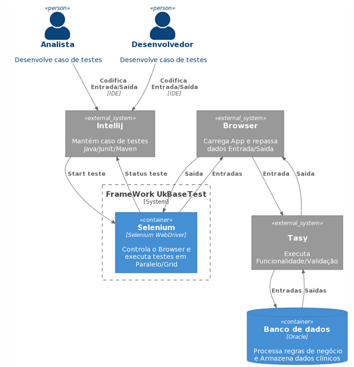

# UkalikoBaseTest
Arquitetura framework de testes UkBaseTest

# Statck
- Java 1.8
- Selenium-java 4.1.0
- Selenium-server-standalone 3.5.3
- Junit 4.13.2
- Maven-surefire-plugin 2.18.1
- Selenium-chrome-driver 4.1.0
- Commons-io 2.11.0
- Apache Maven 3.8.3

# Estrutura de pastas do projeto

- img
- src
- test
- core
- core
- pages
- testes
- utils
- suites
- tasy.core
- tasy.page
- tasy.tests
- resources
- driver
- grid
- target
- screanshot
pom.xml
README.md
